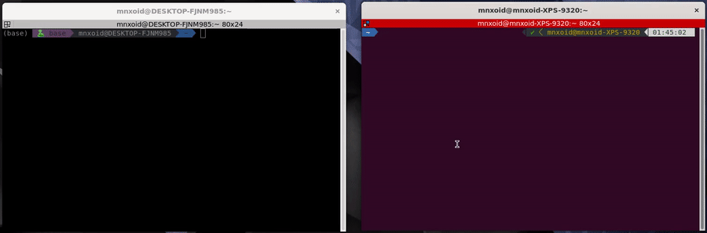

# Localpost

This application is a simple command-line interface (CLI) file sharing tool designed for easy and efficient file
transfers within a local network. With `localpost`, you can serve, explore and download files across the local network
without needing to bother with IP addresses.

## Installation

To use `localpost`, you need to have Rust 1.96.0 or later installed on your system. Follow these steps to build the
binary:

```shell
git clone https://github.com/mnxoid/localpost.git
cd localpost
cargo build --release
target/release/localpost --help
```

### Windows

Since Windows firewall is a pain to work with, in order for the tool to work you need to punch a hole in it:

```shell
New-NetFirewallRule `
    -DisplayName "Localpost" `
    -Direction Inbound `
    -Action Allow `
    -Protocol TCP `
    -LocalPort 9057
```

## Usage



The `localpost` CLI provides several subcommands to perform different operations. Below are brief descriptions and
examples of how to use each command.

### Uploading a file

To start serving a file to the network, use the `upload` command:

```shell
localpost upload <file>
```

Replace `<file>` with the path to the file you want to share.

### Stopping serving a file

To stop serving a specific file by its key, use the `stop` command:

```shell
localpost stop --key <KEY>
```

Replace `<KEY>` with the key associated with the file you want to stop serving.
Alternatively, you can use `--all` to stop serving all files.

### Listing Currently Served Files

To list all files currently being served by the current machine, use the `list` command:

```shell
localpost list
```

### Exploring Network for Files

To search for and list files available on the local network, use the `explore` command:

```shell
localpost explore
```

### Downloading a File

To download a file by its key, use the `download` command. You can choose to print the contents directly or save it to a
specified location:

- Print file contents to stdout:

```shell
localpost download --print <KEY>
```

- Save the file to a specific location:

```shell
localpost download --output <PATH> <KEY>
```

Replace `<KEY>` with the key of the file you want to download, and `<PATH>` with the desired save path.

## Configuration

You can customize the behavior of `localpost` by creating a configuration file. The default location is typically found
in your home directory. Edit the `config.toml` file to adjust settings such as port numbers, session IDs, etc.

## Contributing

Contributions to `localpost` are welcome! Feel free to submit issues or pull requests through GitHub.